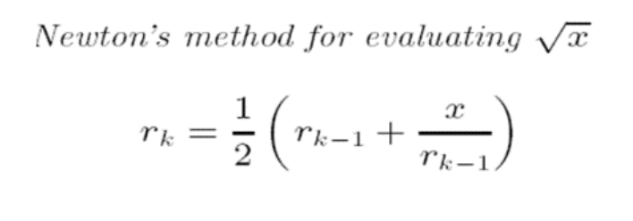

# Answer for *Loop*

> Name: Chen Xingyu
>
> ID: 2023190502016

## Ques 1.

> 1. Please program Newton’s method for finding the root of x. You can use any starting point.
>
> 

Here's my program:

```cpp
#include <stdio.h>
#include <math.h>
// The definition of the function
double Newtom_Method(double X, double startPoint) {
    int r1 = startPoint, r2;
    while (1) {
        r2 = 0.5 * (r1 + X/r1);
        if (abs(r1-r2)<1e-15) break;
        r1 = r2;
    }
    return r2;
}
// The main function
int main(void) {
    printf("Input the value of X and the start point.\n");
    int X_input, startPoint;
    scanf("%d %d",&X_input,&startPoint);
    printf("The root of X is %lf.\n",Newtom_Method(X_input,startPoint));
    return 0;
}
```

## Ques 2.

> 2. Will the following program have runtime error? Try it yourself, explain, and revise.
>
> ```cpp
> int main()
> {
> 	int c = 5, no = 10;
> 	do {
> 		no /= c;
> 	} while(c--);
> 	printf ("%d\n", no);
> 	return 0;
> }
> ```

Yes. If we ignore the lack of `#include <stdio.h>` , there is still a problem in the program.

At the fifth time the program reaches `while(c--)` , the value of `c--` is 1 and the value of c is set as 0. So when to program start the new turn of loop, the statement `no /= c` means `no /= 0` , which is invalid and undefined in C.

So the program will finally print nothing on the screen.

## Ques 3.

> 3. What is the output of the following code? Please explain it
>
> ```cpp
> int main()
> {
>     int n;
>     for (n = 10; n!=0; n--)
>     	printf("%d ", n--);
>     return 0;
> }
> ```

The output of the code is

```
10 8 6 4 2 
```

Here's the explanation of the program:

- Firstly, the variable `n` is defined.
- Then in the "for" statement, `n` is valued as 10, so that `n!=0` is true.
- After that, the program print out the value of `n--` (it's actually the value of the current `n` ) which is 10, and `n` is set as 9
- Then `n--` set the value of `n` as 8, finding `n!=0` is still true. So the program continue processing the loop.
- Because of that, the program print `8 6 4 2 ` .
- After 5 loops, the value of `n` is 0 and `n!=0` is false. The loop ends and the program ends.
